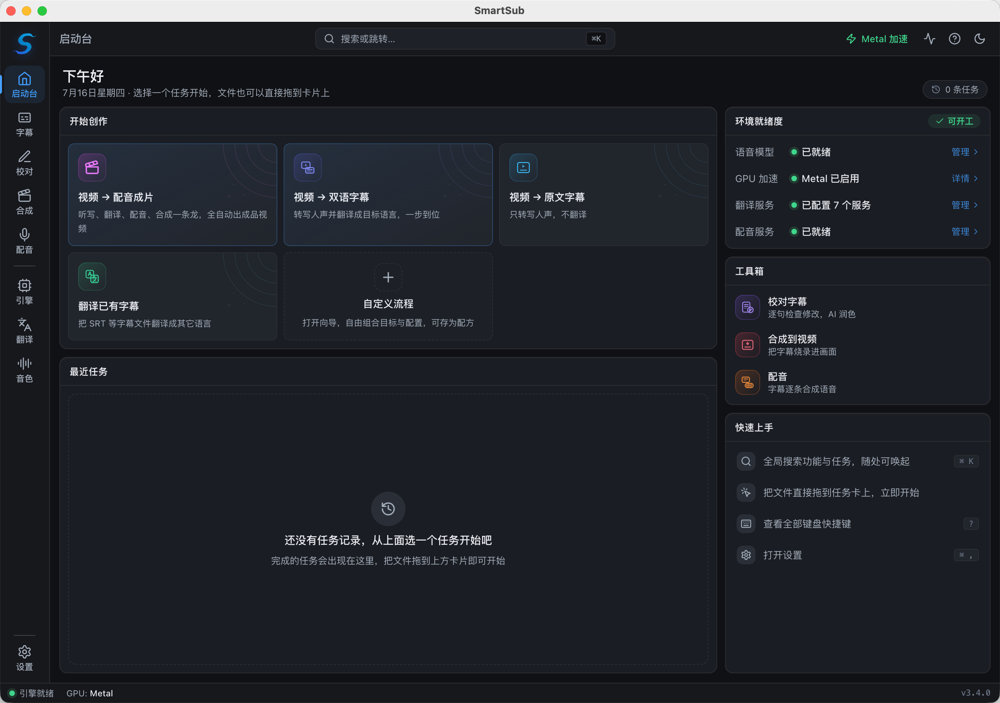
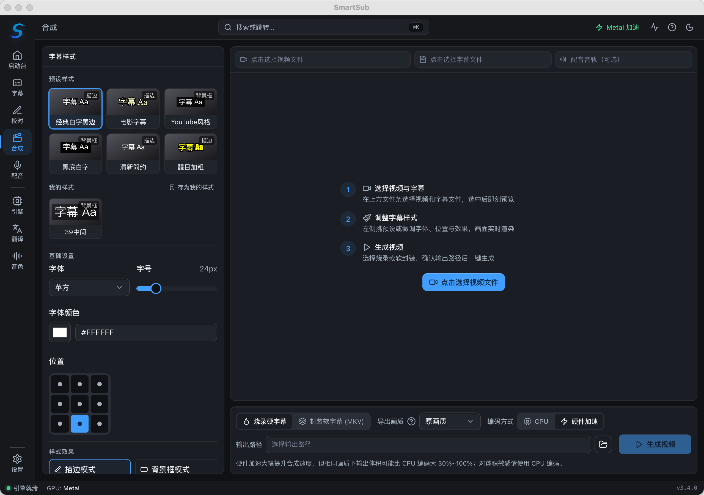
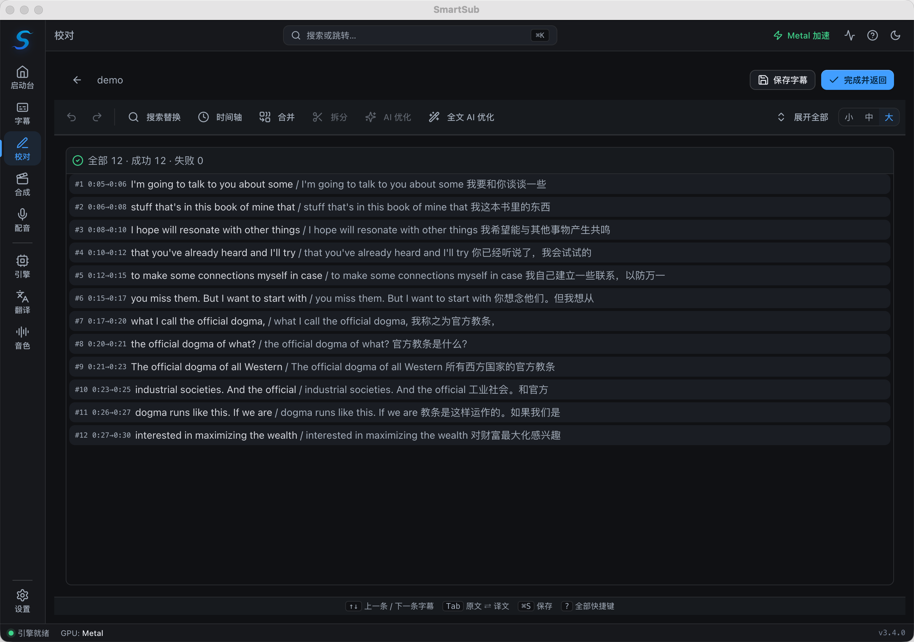

# 🚀 妙幕 / SmartSub

<div align="center">

<a href="https://trendshift.io/repositories/14079?utm_source=repository-badge&amp;utm_medium=badge&amp;utm_campaign=badge-repository-14079" target="_blank" rel="noopener noreferrer"></a>
<a href="https://trendshift.io/repositories/14079?utm_source=trendshift-badge&amp;utm_medium=badge&amp;utm_campaign=badge-trendshift-14079" target="_blank" rel="noopener noreferrer"></a>

<!-- 第一行：核心状态 - CI/版本/许可证/平台 -->

[](https://github.com/buxuku/SmartSub/actions/workflows/release.yml)
[](https://github.com/buxuku/SmartSub/releases/latest)
[](https://github.com/buxuku/SmartSub/blob/master/LICENSE)
[](https://github.com/buxuku/SmartSub/releases)
[](https://github.com/buxuku/SmartSub)

<!-- 第二行：功能特性 - 引擎/翻译服务/硬件加速 -->

[](https://github.com/buxuku/SmartSub#-转写引擎)
[](https://github.com/buxuku/SmartSub#翻译服务)
[](https://developer.nvidia.com/cuda-downloads)
[](https://www.vulkan.org/)
[](https://developer.apple.com/documentation/coreml)

<!-- 第三行：技术栈 -->

[](https://www.electronjs.org/)
[](https://nextjs.org/)
[](https://www.typescriptlang.org/)
[](https://react.dev/)
[](https://tailwindcss.com/)

<!-- 第四行：社区指标 -->

[](https://github.com/buxuku/SmartSub/releases)
[](https://github.com/buxuku/SmartSub/stargazers)
[](https://github.com/buxuku/SmartSub/network/members)
[](https://github.com/buxuku/SmartSub/issues)
[](https://github.com/buxuku/SmartSub/commits)

<br/>

[ 🇨🇳 中文](README.md) | [ 🌏 English](README_EN.md) | [ 🇯🇵 日本語](README_JA.md)

</div>

**让每一帧画面都能美妙地表达**

妙幕（SmartSub）是一款本地优先的桌面应用，帮你**一站式**完成「音视频转字幕 → 翻译 → 校对 → 合成」。所有转写都在本地完成，无需上传文件，隐私无忧；支持批量处理与 GPU 加速，可在 Windows / macOS / Linux 上运行。



## ✨ 3.0 重磅更新

3.0 是一次几乎重写的大版本，核心变化如下：

- **🧠 多转写引擎**：从单一 whisper.cpp 扩展到 **7 种可逐任务切换的引擎**——内置 `whisper.cpp`、`faster-whisper`、`FunASR`、`Qwen3-ASR`、`FireRedASR`、本地 `Whisper CLI`，以及新增的 **云端听写**（OpenAI 兼容 / ElevenLabs / Deepgram / 火山引擎豆包 / 腾讯云 / 阿里云 等在线 ASR）。中文场景可直接选用 FunASR / FireRedASR 等专长模型；无 GPU 或想省事时可选云端听写。
- **⚡ GPU 加速全面重构**：新增 **Vulkan** 后端，**AMD / Intel 显卡**也能在 Windows/Linux 上加速（此前仅支持 NVIDIA CUDA）；新增「自动 / 仅 GPU / 仅 CPU」加速模式，自动识别显卡、按需下载加速包、失败自动回退到 CPU。
- **🎬 视频合成（字幕烧录）**：把字幕**硬烧**进画面，或**软封装**为可切换字幕轨；所见即所得预览，支持字体、字号、颜色、描边、阴影、九宫格位置与多种预设样式。
- **📝 字幕校对 + AI 润色**：内置校对台，逐句对照视频检查修改，支持撤销/重做与 AI 一键润色。
- **🌐 17 个翻译服务**：覆盖主流机器翻译与大模型 API，并支持 OpenAI 风格自定义接入与逐服务的自定义参数。
- **🖥️ 全新任务式界面**：以「您想做什么？」为起点的启动台，任务、字幕校对、视频合成、引擎与模型、翻译服务分区清晰；内置新手引导、命令面板（⌘K / Ctrl+K）、快捷键与下载/任务活动中心。

## 💥 功能特性

### 🧠 字幕生成（转写）

- 支持多种视频/音频格式批量生成字幕
- **7 种转写引擎**，可针对每个任务单独选择（详见 [转写引擎](#-转写引擎)）
- 支持完全本地处理（无需联网上传，保护隐私、速度更快），也可选云端听写把转写交给在线 ASR 服务
- 支持简繁转换、自定义字幕文件名（方便不同播放器挂载识别）
- 可选**中文字幕去标点**，让烧录效果更干净
- 支持自定义并发任务数量，批量处理更高效

### 🌐 字幕翻译

- 对生成的字幕或导入的字幕进行翻译
- **17 个翻译服务**：百度、谷歌、阿里云、火山引擎、豆包、小牛、腾讯、讯飞、DeepLX、Azure、Ollama（本地模型）、DeepSeek、Azure OpenAI、[DeerAPI](https://api.deerapi.com/register?aff=QvHM)、Gemini、SiliconFlow、通义千问
- 兼容任意 **OpenAI 风格 API**，可接入 deepseek / azure 等自有服务
- 输出内容可选纯译文，或「原文 + 译文」双语字幕
- **🎯 自定义参数配置**：无需改代码，直接在界面为每个 AI 服务配置请求头/请求体参数，并支持导出导入

### 📝 字幕校对

- 内置校对台，逐句检查与修改
- 视频对照预览，定位更准
- 支持撤销/重做与 **AI 一键润色**

### 🎬 视频合成

- **硬字幕烧录**：把字幕永久烧进画面，任何播放器都能显示
- **软字幕封装**：以流复制方式无损嵌入可切换字幕轨
- 丰富的样式控制：字体、字号、颜色、描边、阴影、九宫格位置，以及多种预设样式
- 所见即所得实时预览

### ⚡ 隐私与加速

- 本地化处理，文件不出本机
- GPU 加速：NVIDIA CUDA、AMD/Intel Vulkan、Apple Core ML / Metal（详见 [GPU 加速](#-gpu-加速)）
- 内置加速包管理，无需手动安装 CUDA Toolkit

## 📸 界面一览

| 视频合成（字幕烧录）                    | 字幕校对                                       |
| --------------------------------------- | ---------------------------------------------- |
|  |  |

## 🧩 转写引擎

3.0 把「转写引擎」做成了可逐任务切换的能力，可在「引擎与模型」页面统一管理运行时与模型：

| 引擎                     | 说明                                                                                                                                                                                                                                                                                                                                                                                | 运行方式                           |
| ------------------------ | ----------------------------------------------------------------------------------------------------------------------------------------------------------------------------------------------------------------------------------------------------------------------------------------------------------------------------------------------------------------------------------- | ---------------------------------- |
| **whisper.cpp（内置）**  | 默认引擎，支持 ggml 量化模型与 GPU 加速                                                                                                                                                                                                                                                                                                                                             | 随应用内置，开箱即用               |
| **faster-whisper**       | 基于 CTranslate2，速度更快，模型按需从 HuggingFace 下载                                                                                                                                                                                                                                                                                                                             | 自包含 Python 运行时（应用内下载） |
| **FunASR**               | SenseVoice（中/英/日/韩/粤多语）与 Paraformer-zh，中文表现优秀                                                                                                                                                                                                                                                                                                                      | 内置 sherpa-onnx 原生库            |
| **Qwen3-ASR**            | 通义千问语音识别（qwen3-asr-0.6b）                                                                                                                                                                                                                                                                                                                                                  | 内置 sherpa-onnx 原生库            |
| **FireRedASR**           | FireRedASR-AED large（中英），中文表现优秀                                                                                                                                                                                                                                                                                                                                          | 内置 sherpa-onnx 原生库            |
| **本地 Whisper CLI**     | 调用你自行安装的 whisper 兼容命令                                                                                                                                                                                                                                                                                                                                                   | 使用系统已装命令                   |
| **云端听写（在线 ASR）** | OpenAI 兼容 `audio/transcriptions`（如 `whisper-1`、`gpt-4o-transcribe`）、**ElevenLabs Scribe**（`scribe_v1`）、**Deepgram**（`nova-2/3`）、**火山引擎豆包**（`bigmodel` 录音文件识别·极速版）、**腾讯云**（录音文件识别极速版，识别语言自动跟随任务原语言，可选普通版/大模型版档位）与 **阿里云**（录音文件识别极速版，识别语种在控制台项目中配置），支持多服务商、多实例、免 GPU | 在线服务（音频上传到你配置的端点） |

> 提示：FunASR / Qwen3-ASR / FireRedASR 均通过内置的 sherpa-onnx 原生库运行，无需额外环境；faster-whisper 会在应用内下载一个自包含运行时。
>
> 云端听写在「引擎与模型」左栏的「云端听写」分组中配置——每个服务商都是一个独立入口，选中即见配置表单，填入 API Key 与模型即可（可「测试连接」）；OpenAI / Groq / 硅基流动 等 OpenAI 兼容预设直接列在侧栏（选中即填），其它 OpenAI 兼容端点（自建服务、中转站）经云组末尾「添加自定义」接入，可添加多个。火山引擎豆包使用新版「豆包语音」控制台「API Key 管理」签发的 API Key（需先开通「录音文件识别大模型-极速版」；火山方舟的 API Key 不通用），按转写时长计费。腾讯云使用「语音识别」控制台「API 密钥管理」的 AppID / SecretId / SecretKey（需先开通「录音文件识别极速版」，每月赠 5 小时免费额度），识别语言自动跟随任务的「原语言」选择，模型只需选档位——standard 普通版或 large 大模型版（识别更强、计费更高、免费并发仅 5），同样按转写时长计费。阿里云使用 RAM 访问控制的 AccessKey ID / Secret，外加智能语音交互控制台创建项目后的 Appkey——识别语种在项目的「功能配置」中设定（任务原语言对阿里云不生效），默认普通话模型可识别中英混合，其它语种在控制台把项目模型改为对应语种即可；注意其「录音文件识别极速版」**仅提供商用版（无免费试用）**，需先在控制台开通商用版、开通后按转写时长计费。转写时会把音频上传到你配置的第三方端点，首次运行会弹出隐私确认——请勿用于敏感内容，并注意服务商的用量费用。

### whisper 模型怎么选？

whisper.cpp / faster-whisper 使用的是 whisper 系列模型，模型越大越准、越慢、越吃显存：

- 低端设备或核显：推荐 `tiny` / `base`，速度快、占用小
- 普通电脑：从 `small` / `base` 起步，平衡精度与资源
- 高性能显卡/工作站：推荐 `large` 系列，精度最高
- 纯英文音视频：选带 `en` 的模型，专为英语优化
- 在意体积：可用 `q5` / `q8` 量化版本，牺牲少量精度换取更小体积

## ⚡ GPU 加速

软件内置 GPU 加速包管理，**无须手动安装 CUDA Toolkit**。安装后进入「设置 → GPU 加速」，软件会自动检测显卡并推荐合适的加速方案。

| 平台                          | 加速后端            | 说明                                                              |
| ----------------------------- | ------------------- | ----------------------------------------------------------------- |
| Windows / Linux + NVIDIA      | **CUDA**            | 支持 CUDA 11.8.0 / 12.2.0 / 12.4.0 / 13.0.2，应用内下载对应加速包 |
| Windows / Linux + AMD / Intel | **Vulkan**          | 3.0 新增，应用已内置 Vulkan 加速包                                |
| macOS（Apple 芯片）           | **Core ML / Metal** | 下载 mac arm64 版本后自动启用                                     |
| 任意平台                      | **CPU**             | 无可用 GPU 时自动回退                                             |

- 加速模式支持「**自动 / 仅 GPU / 仅 CPU**」，加载失败会自动降级到 CPU，并在诊断面板给出原因
- 如启用加速后出现闪退，可尝试切换其它版本的加速包，或切换为「仅 CPU」模式

## 翻译服务

本项目支持百度、火山引擎、阿里云、腾讯、讯飞、小牛、谷歌、DeepLX，以及 Ollama、DeepSeek、Gemini、通义千问、SiliconFlow、Azure OpenAI、DeerAPI 等大模型/聚合平台，共 17 个翻译服务。使用这些服务需要相应的 API 密钥或配置。

对于百度翻译、火山引擎等服务的 API 申请方法，可以参考 https://bobtranslate.com/service/ ，感谢 [Bob](https://bobtranslate.com/) 这款优秀的软件提供的信息。

对于 AI 翻译，翻译结果受模型和提示词的影响比较大，你可以尝试不同的模型和提示词，找到适合自己的组合。

### 自定义参数配置

SmartSub 支持为每个 AI 翻译服务配置自定义参数，让你精确控制模型行为：

- **灵活配置**：直接在界面添加和管理自定义参数，无需修改代码
- **类型支持**：String、Float、Boolean、Array、Object、Integer
- **实时验证**：参数修改时实时校验，防止无效配置
- **导入导出**：方便团队共享和备份
- **自动保存**：沿用系统设计，任何修改自动保存

## 🔦 使用（普通用户）

请根据自己的电脑系统和芯片，选择下载对应安装包。GPU 加速包无须在下载时选择，安装软件后可在应用内下载。

| 系统    | 芯片  | 下载安装包  | 说明                                            |
| ------- | ----- | ----------- | ----------------------------------------------- |
| Windows | x64   | windows-x64 | NVIDIA 用 CUDA，AMD/Intel 用 Vulkan，应用内下载 |
| Mac     | Apple | mac-arm64   | 自动启用 Core ML / Metal 加速                   |
| Mac     | Intel | mac-x64     | 仅 CPU，不支持 GPU 加速                         |
| Linux   | x64   | linux-x64   | NVIDIA 用 CUDA，AMD/Intel 用 Vulkan，应用内下载 |

### macOS 用户通过 Homebrew 安装（推荐）

macOS 用户可以通过 Homebrew 快速安装，会自动根据芯片类型（Intel/Apple Silicon）下载对应版本：

```bash
# 添加 tap（只需执行一次）
brew tap buxuku/tap

# 安装
brew install --cask smartsub
```

升级和卸载：

```bash
# 升级到最新版本
brew upgrade --cask smartsub

# 卸载
brew uninstall --cask smartsub
```

### 手动下载安装

1. 前往 [release](https://github.com/buxuku/SmartSub/releases) 页面根据自己的操作系统下载安装包
2. 或者使用网盘 [夸克](https://pan.quark.cn/s/0b16479b40ca) 选择对应的版本进行下载
3. 安装并运行程序
4. 跟随新手引导，下载一个语音模型
5. 在「翻译服务」中配置所需的翻译服务（可选）
6. 在启动台选择任务，拖入音视频或字幕文件
7. 设置相关参数（源语言、目标语言、引擎、模型等）
8. 开始处理任务

## 🔦 使用（开发用户）

1️⃣ 克隆本项目在本地

```shell
git clone https://github.com/buxuku/SmartSub.git
```

2️⃣ 在项目中执行 `yarn install` 或者 `npm install`

```shell
cd SmartSub
yarn install
yarn sherpa:fetch # 下载 sherpa-onnx 原生库
```

如果是 windows / linux 平台，或者 Mac intel 平台，请前往 https://github.com/buxuku/whisper.cpp/releases/tag/latest 下载对应的 node 文件，并重命名为 `addon.node` , 覆盖放在 `extraResources/addons/` 目录下。

3️⃣ 依赖包安装好之后，执行 `yarn dev` 或者 `npm run dev` 启动项目

```shell
yarn dev
```

## 手动下载和导入模型

因为模型文件比较大，如果通过该软件下载模型会存在难以下载的情况，可以手动下载模型并导入到应用中。以下是两个可用于下载 whisper 模型的链接：

1. 国内镜像源（下载速度较快）：
   https://hf-mirror.com/ggerganov/whisper.cpp/tree/main

2. Hugging Face 官方源：
   https://huggingface.co/ggerganov/whisper.cpp/tree/main

如果是苹果芯片，需要同时下载模型对应的 encoder.mlmodelc 文件，并解压出来放在模型相同目录下。（如果是 q5 或者 q8 系列的模型，无须下载该文件）

下载完成后，您可以通过应用「引擎与模型」页面中的「导入模型」功能将下载的模型文件导入到应用中。或者直接复制到模型目录里面即可。

导入步骤：

1. 在「引擎与模型」页面中，点击「导入模型」按钮。
2. 在弹出的文件选择器中，选择您下载的模型文件。
3. 确认导入后，模型将被添加到您的已安装模型列表中。

> FunASR / Qwen3-ASR / FireRedASR 等引擎的模型，可在「引擎与模型」页面内按需下载（支持 ModelScope / GitHub 等多源）。

## 常见问题

##### 1. 提示应用程序已损坏，无法打开。

在终端中执行以下命令：

```shell
sudo xattr -dr com.apple.quarantine /Applications/SmartSub.app
```

然后再次运行应用程序。

## 贡献

👏🏻 欢迎提交 Issue 和 Pull Request 来帮助改进这个项目！

## 支持

⭐ 如果您觉得这个项目对您有帮助，欢迎给我一个 star，或者请我喝一杯咖啡（请备注你的 github 账号）。

👨‍👨‍👦‍👦 如果您有任何使用问题，欢迎加入微信交流群，一起交流学习。

| 支付宝收款码                                   | 微信赞赏码                                   | 微信交流群                                  |
| ---------------------------------------------- | -------------------------------------------- | ------------------------------------------- |
|  |  |  |

## 许可证

本项目采用 MIT 许可证。详情请见 [LICENSE](LICENSE) 文件。

## Star History

[](https://star-history.com/#buxuku/SmartSub&Date)
