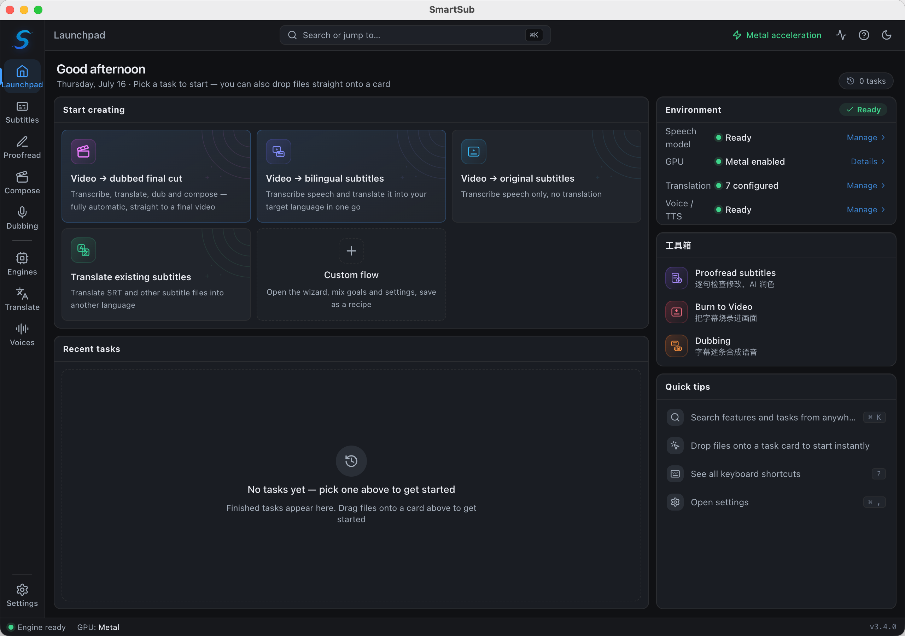
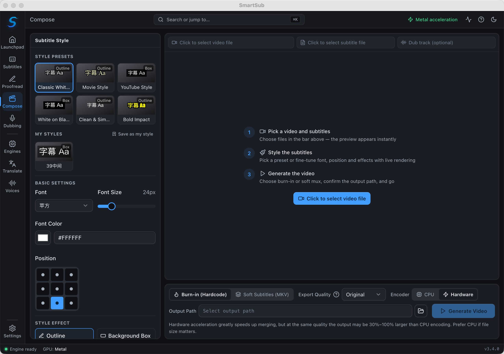
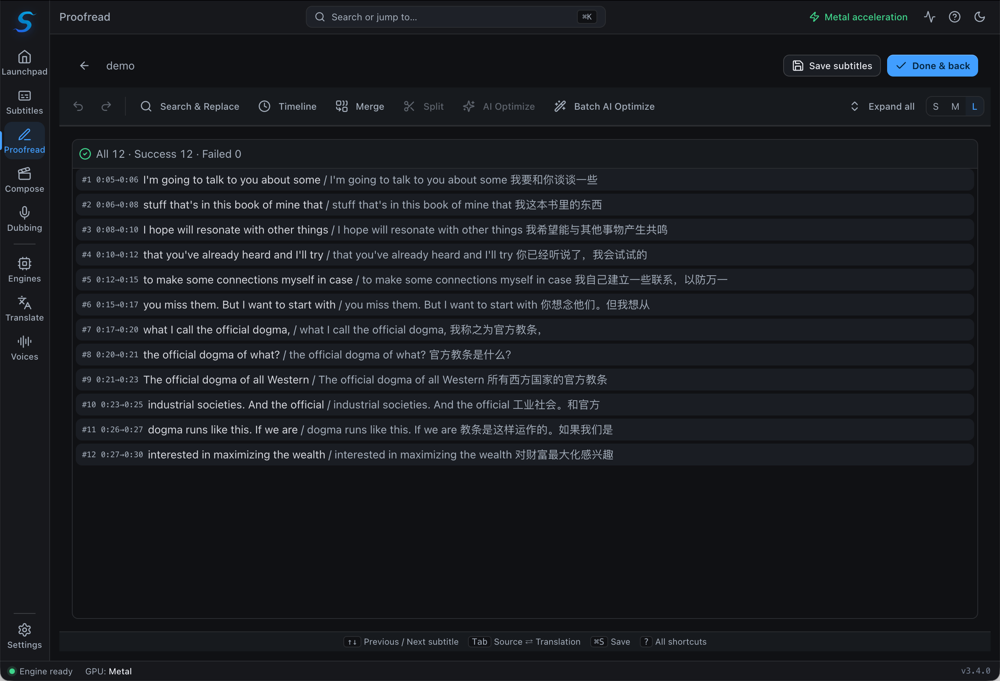

# 🚀 妙幕 / SmartSub

<div align="center">

<a href="https://trendshift.io/repositories/14079?utm_source=repository-badge&amp;utm_medium=badge&amp;utm_campaign=badge-repository-14079" target="_blank" rel="noopener noreferrer"></a>
<a href="https://trendshift.io/repositories/14079?utm_source=trendshift-badge&amp;utm_medium=badge&amp;utm_campaign=badge-trendshift-14079" target="_blank" rel="noopener noreferrer"></a>

<!-- Row 1: Core Status - CI/Version/License/Platform -->

[](https://github.com/buxuku/SmartSub/actions/workflows/release.yml)
[](https://github.com/buxuku/SmartSub/releases/latest)
[](https://github.com/buxuku/SmartSub/blob/master/LICENSE)
[](https://github.com/buxuku/SmartSub/releases)
[](https://github.com/buxuku/SmartSub)

<!-- Row 2: Features - Engines/Translation/Hardware Acceleration -->

[](https://github.com/buxuku/SmartSub#-asr-engines)
[](https://github.com/buxuku/SmartSub#translation-services)
[](https://developer.nvidia.com/cuda-downloads)
[](https://www.vulkan.org/)
[](https://developer.apple.com/documentation/coreml)

<!-- Row 3: Tech Stack -->

[](https://www.electronjs.org/)
[](https://nextjs.org/)
[](https://www.typescriptlang.org/)
[](https://react.dev/)
[](https://tailwindcss.com/)

<!-- Row 4: Community Metrics -->

[](https://github.com/buxuku/SmartSub/releases)
[](https://github.com/buxuku/SmartSub/stargazers)
[](https://github.com/buxuku/SmartSub/network/members)
[](https://github.com/buxuku/SmartSub/issues)
[](https://github.com/buxuku/SmartSub/commits)

<br/>

[ 🇨🇳 中文](README.md) | [ 🌏 English](README_EN.md) | [ 🇯🇵 日本語](README_JA.md)

</div>

**Make every frame speak beautifully**

SmartSub is a local-first desktop app that takes you all the way from **media → subtitles → translation → proofreading → burn-in**. All transcription runs locally — your files never leave your machine. It supports batch processing and GPU acceleration on Windows, macOS, and Linux.



## ✨ What's New in 3.0

3.0 is a near-complete rewrite. The headline changes:

- **🧠 Multiple ASR engines**: from a single whisper.cpp to **7 engines you can switch per task** — built-in `whisper.cpp`, `faster-whisper`, `FunASR`, `Qwen3-ASR`, `FireRedASR`, your local `Whisper CLI`, and the new **Cloud ASR** (OpenAI-compatible / ElevenLabs / Deepgram / Volcengine Doubao / Tencent Cloud / Alibaba Cloud online transcription). For Chinese, reach straight for FunASR / FireRedASR; with no GPU or for quick setup, pick Cloud ASR.
- **⚡ GPU acceleration overhaul**: a new **Vulkan** backend brings **AMD / Intel GPU** acceleration to Windows/Linux (previously NVIDIA CUDA only); new **Auto / GPU-only / CPU-only** modes auto-detect your GPU, download the right acceleration pack on demand, and fall back to CPU on failure.
- **🎬 Video synthesis (burn-in)**: **hardcode** subtitles into the picture, or **soft-mux** them as a switchable track; WYSIWYG preview with control over font, size, color, outline, shadow, 9-grid position, and style presets.
- **📝 Subtitle proofreading + AI polish**: a built-in editor to review line by line against the video, with undo/redo and one-click AI polish.
- **🌐 17 translation services**: mainstream machine-translation and LLM APIs, plus any OpenAI-style endpoint and per-service custom parameters.
- **🖥️ Redesigned, task-oriented UI**: a launchpad that starts from "What would you like to do?", with clear sections for Tasks, Proofread, Burn to Video, Engines & Models, and Translation Services — plus an onboarding guide, command palette (⌘K / Ctrl+K), keyboard shortcuts, and a download/task activity center.

## 💥 Features

### 🧠 Subtitle Generation (Transcription)

- Batch subtitle generation for many video/audio formats
- **7 transcription engines**, selectable per task (see [ASR Engines](#-asr-engines))
- Fully local processing — no uploads, better privacy and speed — or offload to an online ASR service with Cloud ASR
- Simplified/Traditional Chinese conversion and custom subtitle file naming (for player compatibility)
- Optional **Chinese punctuation removal** for cleaner burned-in subtitles
- Configurable number of concurrent tasks for efficient batch runs

### 🌐 Subtitle Translation

- Translate generated subtitles or imported subtitle files
- **17 translation services**: Baidu, Google, Aliyun, Volcano Engine, Doubao, NiuTrans, Tencent, Xunfei, DeepLX, Azure, Ollama (local), DeepSeek, Azure OpenAI, [DeerAPI](https://api.deerapi.com/register?aff=QvHM), Gemini, SiliconFlow, Qwen
- Compatible with any **OpenAI-style API** (deepseek / azure, etc.)
- Output as translation only, or bilingual "original + translation"
- **🎯 Custom Parameter Configuration**: configure request headers/body for each AI service right in the UI — no code changes — with export/import

### 📝 Subtitle Proofreading

- Built-in editor to review and edit line by line
- Side-by-side video preview for accurate positioning
- Undo/redo and **one-click AI polish**

### 🎬 Video Synthesis

- **Hardcode**: burn subtitles permanently into the picture — visible in any player
- **Soft-mux**: losslessly embed a switchable subtitle track via stream copy
- Rich styling: font, size, color, outline, shadow, 9-grid position, and presets
- Real-time WYSIWYG preview

### ⚡ Privacy & Acceleration

- Local processing — files never leave your machine
- GPU acceleration: NVIDIA CUDA, AMD/Intel Vulkan, Apple Core ML / Metal (see [GPU Acceleration](#-gpu-acceleration))
- Built-in acceleration-pack manager — no manual CUDA Toolkit install

## 📸 Screenshots

| Video Synthesis (Burn-in)                  | Subtitle Proofreading                             |
| ------------------------------------------ | ------------------------------------------------- |
|  |  |

## 🧩 ASR Engines

3.0 turns the transcription engine into a per-task choice. Manage runtimes and models from the "Engines & Models" page:

| Engine                     | Notes                                                                                                                                                                                                                                                                                                                                                                                                                                                                                              | How it runs                                      |
| -------------------------- | -------------------------------------------------------------------------------------------------------------------------------------------------------------------------------------------------------------------------------------------------------------------------------------------------------------------------------------------------------------------------------------------------------------------------------------------------------------------------------------------------- | ------------------------------------------------ |
| **whisper.cpp (built-in)** | Default engine; supports ggml quantized models and GPU acceleration                                                                                                                                                                                                                                                                                                                                                                                                                                | Bundled, works out of the box                    |
| **faster-whisper**         | Based on CTranslate2, faster; models downloaded on demand from HuggingFace                                                                                                                                                                                                                                                                                                                                                                                                                         | Self-contained Python runtime (in-app download)  |
| **FunASR**                 | SenseVoice (zh/en/ja/ko/yue) and Paraformer-zh; great for Chinese                                                                                                                                                                                                                                                                                                                                                                                                                                  | Bundled sherpa-onnx native lib                   |
| **Qwen3-ASR**              | Qwen speech recognition (qwen3-asr-0.6b)                                                                                                                                                                                                                                                                                                                                                                                                                                                           | Bundled sherpa-onnx native lib                   |
| **FireRedASR**             | FireRedASR-AED large (zh-en); great for Chinese                                                                                                                                                                                                                                                                                                                                                                                                                                                    | Bundled sherpa-onnx native lib                   |
| **Local Whisper CLI**      | Calls a whisper-compatible command you installed yourself                                                                                                                                                                                                                                                                                                                                                                                                                                          | Uses your system command                         |
| **Cloud ASR (online)**     | OpenAI-compatible `audio/transcriptions` (e.g. `whisper-1`, `gpt-4o-transcribe`), **ElevenLabs Scribe** (`scribe_v1`), **Deepgram** (`nova-2/3`), **Volcengine Doubao** (`bigmodel` flash file recognition), **Tencent Cloud** (flash file recognition; recognition language follows the task's source language, with standard/large billing tiers) and **Alibaba Cloud** (flash file recognition; recognition language configured on the console project); multi-provider, multi-instance, no GPU | Online service (audio uploaded to your endpoint) |

> Note: FunASR / Qwen3-ASR / FireRedASR all run on the bundled sherpa-onnx native library with no extra setup; faster-whisper downloads a self-contained runtime inside the app.
>
> Cloud ASR is configured in the "Cloud ASR" group of the Engines & Models sidebar — each provider has its own entry; select one to see its configuration form, then enter an API key and models (with a "Test connection" button). OpenAI-compatible presets (OpenAI / Groq / SiliconFlow) are listed directly in the sidebar — select and fill; any other OpenAI-compatible endpoint (self-hosted, proxy) can be connected via the "Add custom" entry at the end of the cloud group, with as many entries as you need. Volcengine Doubao uses an API Key issued under "API Key management" in the Doubao Speech console (activate the flash file-recognition model first; Volcano Ark API keys are not interchangeable), billed by transcription duration. Tencent Cloud uses the AppID / SecretId / SecretKey from "API key management" in the ASR console (activate "Recording File Recognition (Flash)" first; 5 free hours per month); the recognition language follows the task's source-language selection automatically, and the model picker only chooses the billing tier — standard, or large (LLM-based, better accuracy, higher price, free concurrency capped at 5) — also billed by duration. Alibaba Cloud uses a RAM AccessKey ID / Secret plus the Appkey of a project created in the Intelligent Speech Interaction console — the recognition language is set in the project's feature configuration (the task's source language has no effect for Alibaba); the default Mandarin model also handles mixed Chinese-English, and for other languages simply switch the project's model in the console. Note its flash file-recognition service is **commercial-only (no free trial)** — activate the commercial edition first, then usage is billed by duration. Transcription uploads audio to the third-party endpoint you configure; a privacy confirmation appears on first run — avoid sensitive content and mind the provider's usage costs.

### How to choose a whisper model

whisper.cpp / faster-whisper use the whisper family of models. Bigger models are more accurate but slower and need more VRAM:

- Low-end devices or integrated GPUs: use `tiny` / `base` — fast and lightweight
- Typical computers: start with `small` / `base` to balance accuracy and resources
- High-performance GPUs/workstations: use the `large` series for top accuracy
- English-only media: pick a model with `en` for English-optimized results
- Care about size: use `q5` / `q8` quantized variants for a smaller footprint at a slight accuracy cost

## ⚡ GPU Acceleration

SmartSub ships with a built-in acceleration-pack manager — **no need to install the CUDA Toolkit manually**. After installing, open "Settings → GPU Acceleration"; the app detects your GPU and recommends a suitable option.

| Platform                      | Backend             | Notes                                                                              |
| ----------------------------- | ------------------- | ---------------------------------------------------------------------------------- |
| Windows / Linux + NVIDIA      | **CUDA**            | Supports CUDA 11.8.0 / 12.2.0 / 12.4.0 / 13.0.2; download the matching pack in-app |
| Windows / Linux + AMD / Intel | **Vulkan**          | New in 3.0 — built-in Vulkan acceleration pack                                     |
| macOS (Apple Silicon)         | **Core ML / Metal** | Enabled automatically with the mac arm64 build                                     |
| Any platform                  | **CPU**             | Automatic fallback when no GPU is available                                        |

- Acceleration modes: **Auto / GPU-only / CPU-only**; on load failure it automatically falls back to CPU and explains why in the diagnostics panel
- If the app crashes after enabling acceleration, try a different pack version or switch to CPU-only mode

## Translation Services

This project supports 17 translation services, including Baidu, Volcano Engine, Aliyun, Tencent, Xunfei, NiuTrans, Google, DeepLX, plus LLM/aggregation platforms such as Ollama, DeepSeek, Gemini, Qwen, SiliconFlow, Azure OpenAI, and [DeerAPI](https://api.deerapi.com/register?aff=QvHM). Using these services requires the appropriate API keys or configuration.

For information on obtaining API keys for services like Baidu Translation and Volcano Engine, please refer to https://bobtranslate.com/service/. We appreciate the information provided by [Bob](https://bobtranslate.com/), an excellent software tool.

For AI translation, results are heavily influenced by the model and prompt, so try different combinations to find what works for you. We recommend the AI aggregation platform [DeerAPI](https://api.deerapi.com/register?aff=QvHM), which supports nearly 500 models across multiple platforms.

### Custom Parameter Configuration

SmartSub lets you configure custom parameters for each AI translation service to precisely control model behavior:

- **Flexible setup**: add and manage parameters directly in the UI, no code changes
- **Type support**: String, Float, Boolean, Array, Object, Integer
- **Real-time validation**: validates as you edit to prevent invalid configurations
- **Import/Export**: easy team sharing and backup
- **Auto-save**: every change is saved automatically, in line with the rest of the app

## 🔦 Usage (For End Users)

Download the package for your system and chip. GPU acceleration packs are not chosen at download time — get them in-app after installing.

| System  | Chip  | Download Package | Notes                                                |
| ------- | ----- | ---------------- | ---------------------------------------------------- |
| Windows | x64   | windows-x64      | NVIDIA → CUDA, AMD/Intel → Vulkan, downloaded in-app |
| Mac     | Apple | mac-arm64        | Core ML / Metal acceleration enabled automatically   |
| Mac     | Intel | mac-x64          | CPU only, no GPU acceleration                        |
| Linux   | x64   | linux-x64        | NVIDIA → CUDA, AMD/Intel → Vulkan, downloaded in-app |

### Install via Homebrew (macOS) (Recommended)

macOS users can quickly install via Homebrew, which automatically downloads the correct version based on chip type (Intel/Apple Silicon):

```bash
# Add tap (only needed once)
brew tap buxuku/tap

# Install
brew install --cask smartsub
```

Upgrade and uninstall:

```bash
# Upgrade to latest version
brew upgrade --cask smartsub

# Uninstall
brew uninstall --cask smartsub
```

### Manual Download

1. Go to the [releases](https://github.com/buxuku/SmartSub/releases) page and download the appropriate package for your operating system
2. Or use the cloud disk [Quark](https://pan.quark.cn/s/0b16479b40ca) to download the corresponding version
3. Install and run the program
4. Follow the onboarding guide and download a speech model
5. Configure your translation services under "Translation Services" (optional)
6. From the launchpad, pick a task and drop in your media or subtitle files
7. Set the parameters (source language, target language, engine, model, etc.)
8. Start the processing task

## 🔦 Usage (For Developers)

1️⃣ Clone the project locally

```shell
git clone https://github.com/buxuku/SmartSub.git
```

2️⃣ Install dependencies using `yarn install` or `npm install`

```shell
cd SmartSub
yarn install
yarn sherpa:fetch # download sherpa-onnx native library
```

If you are on Windows / Linux, or Mac intel platform, please download the node file from https://github.com/buxuku/whisper.cpp/releases/tag/latest and rename it to 'addon.node' and overlay it in the 'extraResources/addons/' directory.

3️⃣ After installing dependencies, run `yarn dev` or `npm run dev` to launch the project

```shell
yarn dev
```

## Manually Downloading and Importing Models

Due to the large size of model files, downloading them through the software may be challenging. You can manually download models and import them into the application. Here are two links for downloading whisper models:

1. Domestic mirror (faster download speeds):
   https://hf-mirror.com/ggerganov/whisper.cpp/tree/main

2. Hugging Face official source:
   https://huggingface.co/ggerganov/whisper.cpp/tree/main

If you are using an Apple Silicon chip, you also need to download the corresponding encoder.mlmodelc file and unzip it into the same directory as the model. (Not required for q5 or q8 series models.)

After downloading, you can import the model files via the "Import Model" feature on the "Engines & Models" page, or copy them directly into the model directory.

Import steps:

1. On the "Engines & Models" page, click the "Import Model" button.
2. In the file selector that appears, choose your downloaded model file.
3. After confirming the import, the model will be added to your list of installed models.

> Models for engines like FunASR / Qwen3-ASR / FireRedASR can be downloaded on demand from within the "Engines & Models" page (multiple sources such as ModelScope / GitHub are supported).

## Common Issues

##### 1. "The application is damaged and can't be opened" message

Execute the following command in the terminal:

```shell
sudo xattr -dr com.apple.quarantine /Applications/SmartSub.app
```

Then try running the application again.

## Contributing

👏🏻 Issues and Pull Requests are welcome to help improve this project!

## Support

⭐ If you find this project helpful, feel free to give me a star, or buy me a cup of coffee (please note your GitHub account).

👨‍👨‍👦‍👦 If you have any use problems, welcome to join the wechat communication group, exchange and learn together.

| Alipay donation code                           | WeChat donation code                         | WeChat communication group                  |
| ---------------------------------------------- | -------------------------------------------- | ------------------------------------------- |
|  |  |  |

## License

This project is licensed under the MIT License. See the [LICENSE](LICENSE) file for details.

## Star History

[](https://star-history.com/#buxuku/SmartSub&Date)
