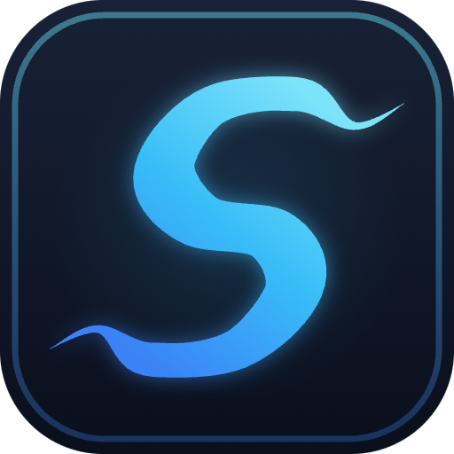

<div align="center">



# 妙幕 / SmartSub

**文字起こし・字幕翻訳・AI 吹き替え・字幕焼き込みをワンストップで——オープンソースのデスクトップアプリ**

すべてのフレームを美しく表現する

<a href="https://trendshift.io/repositories/14079?utm_source=repository-badge&amp;utm_medium=badge&amp;utm_campaign=badge-repository-14079" target="_blank" rel="noopener noreferrer"></a>
<a href="https://trendshift.io/repositories/14079?utm_source=trendshift-badge&amp;utm_medium=badge&amp;utm_campaign=badge-trendshift-14079" target="_blank" rel="noopener noreferrer"></a>

[](https://github.com/buxuku/SmartSub/releases/latest)
[](https://github.com/buxuku/SmartSub/releases)
[](https://github.com/buxuku/SmartSub/releases)
[](https://github.com/buxuku/SmartSub/blob/master/LICENSE)

[中文](README.md) | [English](README_EN.md) | [日本語](README_JA.md)

[ダウンロード](#ダウンロードとインストール) · [機能](#機能) · [無料ワークフロー](#完全無料のワークフロー) · [FAQ](#faq) · [更新履歴](https://github.com/buxuku/SmartSub/releases)

</div>


## SmartSub とは

妙幕（SmartSub）はオープンソースの字幕・吹き替えツールです。**音声の文字起こし → 字幕翻訳 → 校正 → AI 吹き替え（TTS）→ 焼き込み合成** という一連のパイプラインを、1 つのデスクトップアプリで完結できます。文字起こしは whisper.cpp や sherpa-onnx などのローカルモデルで実行され、ファイルが外部に送信されることはありません。バッチ処理に対応し、NVIDIA / AMD / Intel / Apple Silicon の GPU アクセラレーションを利用でき、Windows・macOS・Linux で動作します。

**パイプライン全体を完全無料で実行できます**：ローカルモデルによる文字起こし、内蔵の無料翻訳ソース、ローカル TTS 吹き替え（ボイスクローン含む）、ローカル ffmpeg による焼き込み——API キーは不要で、ローカル処理に使用量の制限もありません。必要に応じて、20 の翻訳サービス、8 社のクラウド文字起こし、5 種類のクラウド TTS をオプションとして追加できます。

## こんなことができます

| やりたいこと                         | SmartSub での実現方法                                                    |
| ------------------------------------ | ------------------------------------------------------------------------ |
| 字幕のない海外動画・講義を見たい     | 動画をドロップしてローカルで文字起こし＋翻訳、バイリンガル字幕を即生成   |
| 動画を多言語向けにローカライズしたい | 字幕を翻訳し、TTS で新しい音声トラックとして吹き替え、完成動画を書き出し |
| 自分の声で動画をナレーションしたい   | 短い参照音声を録音するだけで声をクローンし、動画全体を自分の声で朗読     |
| ポッドキャスト・会議録音を整理したい | SRT ファイルへ一括文字起こしして、編集・検索・アーカイブに活用           |
| 完成動画に字幕を焼き込みたい         | 校正ツールで 1 行ずつ確認後、WYSIWYG スタイルでハード/ソフト焼き込み     |

## 機能

音声・動画 → **文字起こし** → **翻訳** → **校正** → **吹き替え** → **書き出し**。各ステップは単独でも、バッチパイプラインとしてつなげても使えます。

### 字幕生成（文字起こし）

- 様々な動画 / 音声フォーマットの字幕を一括生成、同時実行数も調整可能
- 7 系統のエンジンをタスクごとに切り替え：内蔵 `whisper.cpp`、`faster-whisper`、`FunASR`、`Qwen3-ASR`、`FireRedASR`、ローカル `Whisper CLI`、そして GPU 不要のクラウド文字起こし（8 社）
- ローカルエンジンは完全オフライン——アップロード一切なし。中国語コンテンツには FunASR / FireRedASR が強力
- 簡体字/繁体字変換、カスタム字幕ファイル名（プレーヤーの自動読み込みに対応）、中国語字幕の句読点除去（任意）

### 字幕翻訳

- 20 の翻訳サービス：内蔵の無料翻訳（Bing / Google 無料エンドポイント、自動フォールバックとレート制限付き）、百度、阿里云、騰訊、讯飞、火山エンジン、豆包、小牛、DeepLX、Azure、Google に加え、Ollama（ローカルモデル）、DeepSeek、Gemini、通義千問（Qwen）、SiliconFlow、Azure OpenAI、[DeerAPI](https://api.deerapi.com/register?aff=QvHM) などの LLM サービス
- 任意の OpenAI スタイル API に対応——自前のエンドポイントも接続可能
- 翻訳のみ、または「原文 + 訳文」のバイリンガル字幕を出力
- 各 AI サービスのリクエストパラメータを UI から直接設定、インポート/エクスポート対応——コード変更不要

### 字幕校正

- 内蔵エディタで動画と並べて 1 行ずつ確認・修正
- 元に戻す/やり直し、1 行単位の削除と復元
- ワンクリック AI 推敲

### TTS 吹き替えとボイスクローン

- 専用の吹き替えワークベンチ：字幕ファイル 1 つ＋任意の動画から、1 行ずつ音声合成してタイムラインへ自動整合
- ローカルエンジンはオフラインかつ無料：Kokoro 多言語（103 ボイス）、VITS 中国語（174 ボイス）
- ボイスクローン：ローカル ZipVoice ゼロショットクローン（参照音声 1 本ですぐ使用可能）に加え、火山エンジン声音複刻 2.0、ElevenLabs インスタントクローンにも対応
- クラウドサービス：Edge TTS 無料枠、OpenAI 互換エンドポイント（OpenAI / SiliconFlow など）、Azure Speech、火山エンジン豆包、ElevenLabs
- タイムライン整合：話速の事前制御、実測による再チェック、無音ギャップからの時間借用。制限を超えた行はレビューリストへ（テキスト修正 / 行単位の再生成 / テンポ変更の受け入れ）
- 行ごとの試聴・ボイス切り替え・再合成。元の音声トラックはミュートまたはダッキング（音量抑制）を選択
- 出力は音声のみ（wav / mp3）、音声トラック置換、ミックス動画、MKV デュアル音声から選択。整合後の字幕も同時に書き出し可能

### 動画合成（字幕焼き込み）

- ハードサブ：字幕を映像に恒久的に焼き込み、どのプレーヤーでも表示
- ソフトサブ：ストリームコピーで切り替え可能な字幕トラックを無劣化で埋め込み
- フォント・サイズ・色・縁取り・影・9 分割位置・プリセットスタイル
- リアルタイムの WYSIWYG プレビュー

### プライバシーとハードウェアアクセラレーション

- ローカル処理——ファイルは端末の外に出ません。クラウドサービスはすべてオプトインで、初回利用時にプライバシー確認あり
- GPU アクセラレーション：NVIDIA CUDA、AMD / Intel Vulkan、Apple Core ML / Metal
- アクセラレーションパックはアプリ内でダウンロード——CUDA Toolkit の手動インストール不要。失敗時は CPU へ自動フォールバック

## スクリーンショット

| 動画合成（字幕焼き込み）                | 字幕校正                                       |
| --------------------------------------- | ---------------------------------------------- |
|  |  |

## 完全無料のワークフロー

コストを抑えたい方へ。以下のルートなら費用ゼロ、アカウント登録も不要です：

| ステップ     | 無料の選択肢                                                                     | 補足                                           |
| ------------ | -------------------------------------------------------------------------------- | ---------------------------------------------- |
| 文字起こし   | whisper.cpp / faster-whisper / FunASR / Qwen3-ASR / FireRedASR のローカルモデル  | モデルは一度ダウンロードすればオフラインで動作 |
| 翻訳         | 内蔵無料翻訳（Bing / Google エンドポイント、自動フォールバック）、Ollama、DeepLX | 無料翻訳は設定ゼロで即使用可能                 |
| TTS 吹き替え | ローカル Kokoro / VITS / ZipVoice ボイスクローン、Edge TTS 無料枠                | ローカル合成はオフラインで使用量制限なし       |
| 焼き込み     | 内蔵 ffmpeg                                                                      | 完全ローカル処理                               |

有料クラウドサービス（OpenAI、ElevenLabs、火山エンジン、騰訊云など）はすべてオプションです。必要なときだけお使いください。

## ダウンロードとインストール

お使いのシステムとチップに合ったパッケージを選んでください。GPU アクセラレーションパックはダウンロード時には不要で、インストール後にアプリ内で取得します。

| システム | チップ | パッケージ  | 補足                                                           |
| -------- | ------ | ----------- | -------------------------------------------------------------- |
| Windows  | x64    | windows-x64 | NVIDIA は CUDA、AMD / Intel は Vulkan をアプリ内でダウンロード |
| macOS    | Apple  | mac-arm64   | Core ML / Metal アクセラレーションが自動有効                   |
| macOS    | Intel  | mac-x64     | CPU のみ、GPU アクセラレーション非対応                         |
| Linux    | x64    | linux-x64   | NVIDIA は CUDA、AMD / Intel は Vulkan をアプリ内でダウンロード |

入手先：[GitHub Releases](https://github.com/buxuku/SmartSub/releases) ｜ [Quark ミラー](https://pan.quark.cn/s/0b16479b40ca)

macOS では Homebrew が最も手軽です。チップに合ったビルドを自動で選択します：

```bash
brew tap buxuku/tap          # 初回のみ
brew install --cask smartsub # インストール
brew upgrade --cask smartsub # アップグレード
```

### 3 ステップで開始

1. インストール後、初回ガイドに従って音声モデルをダウンロード（GPU がない、またはモデルを入れたくない場合はクラウド文字起こしを設定）
2. ランチパッドからタスクを選び、音声・動画または字幕ファイルをドロップして、ソース言語・ターゲット言語などを設定
3. 処理を開始——完了後は校正・吹き替え・焼き込みへ続けられます

## さらに詳しく

<details>
<summary><b>文字起こしエンジンの比較</b></summary>

<br/>

エンジンはタスクごとに選択できます。ランタイムとモデルは「エンジンとモデル」ページでまとめて管理します：

| エンジン                 | 説明                                                                        | 動作方式                                                 |
| ------------------------ | --------------------------------------------------------------------------- | -------------------------------------------------------- |
| **whisper.cpp（内蔵）**  | デフォルトエンジン。ggml 量子化モデルと GPU アクセラレーションに対応        | アプリ内蔵、すぐに利用可能                               |
| **faster-whisper**       | CTranslate2 ベースで高速。モデルは HuggingFace から必要に応じてダウンロード | 自己完結型 Python ランタイム（アプリ内でダウンロード）   |
| **FunASR**               | SenseVoice（中/英/日/韓/粤）と Paraformer-zh。中国語に強い                  | 内蔵 sherpa-onnx ネイティブライブラリ                    |
| **Qwen3-ASR**            | 通義千問の音声認識（qwen3-asr-0.6b）                                        | 内蔵 sherpa-onnx ネイティブライブラリ                    |
| **FireRedASR**           | FireRedASR-AED large（中英）。中国語に強い                                  | 内蔵 sherpa-onnx ネイティブライブラリ                    |
| **ローカル Whisper CLI** | 自分でインストールした whisper 互換コマンドを呼び出し                       | システムにインストール済みのコマンドを使用               |
| **クラウド文字起こし**   | 8 社のオンラインサービス。GPU 不要、複数プロバイダー・複数インスタンス対応  | オンラインサービス（設定したエンドポイントへ音声を送信） |

FunASR / Qwen3-ASR / FireRedASR は内蔵の sherpa-onnx ネイティブライブラリで動作し、追加環境は不要です。faster-whisper はアプリ内で自己完結型ランタイムをダウンロードします。

</details>

<details>
<summary><b>クラウド文字起こし：8 社のプロバイダー</b></summary>

<br/>

クラウド文字起こしは「エンジンとモデル」サイドバーの「クラウド文字起こし」グループで設定します。プロバイダーごとに独立した項目があり、選択して認証情報を入力するだけ（「接続テスト」あり）。文字起こし時には設定先エンドポイントへ音声がアップロードされ、初回にプライバシー確認が表示されます。機密コンテンツには使用せず、各プロバイダーの利用料金にご注意ください。

- **OpenAI 互換**：`audio/transcriptions` プロトコル（`whisper-1`、`gpt-4o-transcribe` など）。OpenAI / Groq / SiliconFlow のプリセットをサイドバーに用意。その他の互換エンドポイント（セルフホスト、プロキシ）は「カスタム追加」から複数接続可能
- **ElevenLabs Scribe**：`scribe_v1` モデル
- **Deepgram**：`nova-2` / `nova-3` モデル
- **火山エンジン豆包**：録音ファイル認識・高速版（bigmodel）。「豆包語音」コンソールの「API Key 管理」で発行した API キーを使用（先にモデルの有効化が必要。火山方舟の API キーは使用不可）。文字起こし時間に応じて課金
- **騰訊云**：録音ファイル認識高速版。音声認識コンソールの AppID / SecretId / SecretKey を使用（先に有効化が必要。毎月 5 時間の無料枠あり）。認識言語はタスクのソース言語に自動追従し、モデルは料金ティアのみ選択——standard 標準版、または large 大規模モデル版（高精度・高価格・無料枠の同時実行は 5 まで）
- **阿里云**：録音ファイル認識高速版。RAM アクセス制御の AccessKey ID / Secret と、インテリジェント音声インタラクションコンソールで作成したプロジェクトの Appkey を使用。認識言語はプロジェクトの機能設定で指定（タスクのソース言語は無効）。デフォルトの標準中国語モデルは中英混在にも対応。このサービスは**商用版のみ（無料トライアルなし）**で、有効化後は時間課金
- **讯飞（iFlytek）**：録音ファイル文字起こし大規模モデル。非同期オーダー制で、アプリを終了してもタスクは失われません
- **Gladia**：solaria モデル、100 以上の言語に対応、毎月 10 時間の無料枠あり

</details>

<details>
<summary><b>whisper モデルの選び方</b></summary>

<br/>

whisper.cpp / faster-whisper は whisper 系のモデルを使用します。モデルが大きいほど高精度ですが、低速で VRAM を多く消費します：

- ローエンド端末や内蔵 GPU：`tiny` / `base` がおすすめ。高速・軽量
- 一般的な PC：`small` / `base` から始めて精度とリソースのバランスを取る
- 高性能 GPU / ワークステーション：`large` シリーズで最高精度
- 英語のみの音声・動画：英語最適化の `en` 付きモデルを選択
- サイズが気になる場合：`q5` / `q8` の量子化版でわずかな精度低下と引き換えに軽量化

</details>

<details>
<summary><b>GPU アクセラレーション</b></summary>

<br/>

本アプリはアクセラレーションパック管理を内蔵しており、CUDA Toolkit を手動でインストールする必要はありません。GPU アクセラレーションは「エンジンとモデル」ページで管理します。アプリが GPU を検出して適切な方式を推奨します。

| プラットフォーム              | バックエンド        | 説明                                                                              |
| ----------------------------- | ------------------- | --------------------------------------------------------------------------------- |
| Windows / Linux + NVIDIA      | **CUDA**            | CUDA 11.8.0 / 12.2.0 / 12.4.0 / 13.0.2 に対応。対応パックをアプリ内でダウンロード |
| Windows / Linux + AMD / Intel | **Vulkan**          | Vulkan アクセラレーションパックはアプリに同梱                                     |
| macOS（Apple シリコン）       | **Core ML / Metal** | mac arm64 版で自動的に有効                                                        |
| すべてのプラットフォーム      | **CPU**             | 利用可能な GPU がない場合は自動フォールバック                                     |

- アクセラレーションモードは「自動 / GPU のみ / CPU のみ」に対応。読み込みに失敗すると自動的に CPU へフォールバックし、診断パネルに理由を表示します
- アクセラレーション有効後にクラッシュする場合は、「CPU のみ」モードに変更するか、他の文字起こしエンジンへ切り替えてください

</details>

<details>
<summary><b>翻訳サービスとカスタムパラメータ</b></summary>

<br/>

クラウド翻訳サービスの利用には、各サービスの API キーまたは設定が必要です。百度翻訳や火山エンジンなどの API キー取得方法は [Bob のサービスガイド](https://bobtranslate.com/service/) を参照してください。優れたアプリである [Bob](https://bobtranslate.com/) のドキュメントに感謝します。

AI 翻訳の品質はモデルとプロンプトに大きく左右されます。様々な組み合わせを試して、コンテンツに合うものを見つけてください。

各 AI 翻訳サービスはカスタムパラメータ設定に対応し、モデルの動作を精密に制御できます：

- コード変更なしで、UI から直接パラメータを追加・管理
- 型サポート：String、Float、Boolean、Array、Object、Integer
- リアルタイム検証で無効な設定を防止
- インポート/エクスポートで共有・バックアップが容易

</details>

<details>
<summary><b>吹き替えエンジンと出力モード</b></summary>

<br/>

ローカルエンジンは sherpa-onnx 上で動作し、完全オフラインかつ無料です：

| モデル                  | 言語    | ボイス数     | 説明                                                      |
| ----------------------- | ------- | ------------ | --------------------------------------------------------- |
| Kokoro 多言語 v1.1      | 中 / 英 | 103          | 英語・中国語のボイスがバランスよく揃った多言語モデル      |
| VITS 中国語 AIShell3    | 中      | 174          | 中国語話者ライブラリ                                      |
| ZipVoice ボイスクローン | 中 / 英 | ユーザー作成 | ゼロショットクローン：参照音声 1 本とその書き起こしで完成 |

クラウドプロバイダーはすべてオプションです：

| サービス         | 説明                                                                                                               |
| ---------------- | ------------------------------------------------------------------------------------------------------------------ |
| Edge TTS         | 無料・キー不要。リバースエンジニアリング系の試用枠のため可用性は保証されません——停止時は他エンジンへ切り替えを推奨 |
| OpenAI 互換      | `audio/speech` プロトコル。OpenAI / SiliconFlow プリセット内蔵、カスタムエンドポイントも追加可能                   |
| Azure Speech     | Microsoft Neural ボイス体系（700+）、SSML による話速制御                                                           |
| 火山エンジン豆包 | 豆包音声合成のボイスに加え、声音複刻 2.0 のクローンボイスに対応                                                    |
| ElevenLabs       | 多言語モデル、インスタントボイスクローン（IVC）対応                                                                |

タイムライン整合の仕組み：目標時間から話速を事前設定して合成し、実測時間で再チェック（ローカルエンジンは無料で再合成、クラウドは atempo でテンポ調整）。それでも足りない場合は隣接する無音ギャップから時間を借用します。話速 1.5 倍の上限を超えた行はレビューリストに入り、テキスト修正・行単位の再生成・テンポ変更の受け入れから選べます。

クローンボイスの作成時には、参照音声を自動で品質チェック（長さ、SN 比、クリッピング、音量など）し、問題箇所と修正のヒントを提示します。

</details>

<details>
<summary><b>モデルの手動ダウンロードとインポート</b></summary>

<br/>

モデルファイルは大きいため、アプリ内ダウンロードが難しい場合は手動でダウンロードしてインポートできます。whisper モデルの入手先：

1. ミラー（地域によっては高速）：https://hf-mirror.com/ggerganov/whisper.cpp/tree/main
2. Hugging Face 公式：https://huggingface.co/ggerganov/whisper.cpp/tree/main

Apple シリコンの場合は、モデルに対応する `encoder.mlmodelc` ファイルもダウンロードし、解凍してモデルと同じディレクトリに配置してください（`q5` / `q8` シリーズでは不要）。

インポート手順：「エンジンとモデル」ページで「モデルをインポート」をクリックし、ダウンロードしたファイルを選択します。モデルディレクトリへ直接コピーしても構いません。

FunASR / Qwen3-ASR / FireRedASR などのモデルは「エンジンとモデル」ページ内で必要に応じてダウンロードできます（ModelScope / GitHub など複数ソース対応）。

</details>

## FAQ

<details>
<summary><b>macOS で「アプリケーションが破損しているため開けません」と表示される</b></summary>

<br/>

ターミナルで以下を実行してから、アプリを再度起動してください：

```bash
sudo xattr -dr com.apple.quarantine /Applications/SmartSub.app
```

</details>

<details>
<summary><b>モデルのダウンロードが遅い・失敗する</b></summary>

<br/>

モデルを手動でダウンロードしてインポートしてください——[さらに詳しく](#さらに詳しく) を参照。地域によっては hf-mirror ソースの方が高速です。

</details>

<details>
<summary><b>GPU アクセラレーション有効後にアプリがクラッシュする</b></summary>

<br/>

「エンジンとモデル」ページでアクセラレーションモードを「CPU のみ」に切り替えるか、他の文字起こしエンジンをお試しください。診断パネルに失敗の理由が表示されます。

</details>

## コントリビュート

Issue や Pull Request を歓迎します。

<details>
<summary><b>ローカルビルド</b></summary>

<br/>

1. プロジェクトをクローンして依存関係をインストール（インストールフックが whisper addon と sherpa-onnx ネイティブライブラリを自動ダウンロードします）：

```bash
git clone https://github.com/buxuku/SmartSub.git
cd SmartSub
yarn install
```

2. 開発環境を起動：

```bash
yarn dev
```

ネイティブ依存の自動ダウンロードに失敗した場合（ネットワーク制限など）は、`yarn native:fetch` を手動で実行して再試行してください。

</details>

## コミュニティとサポート

このプロジェクトが役立ったら、スターを付けていただくか、作者にコーヒーをおごってください（GitHub アカウントを備考欄にご記入ください）。使い方の質問は WeChat グループへどうぞ。

| Alipay 寄付コード                              | WeChat 寄付コード                            | WeChat グループ                             |
| ---------------------------------------------- | -------------------------------------------- | ------------------------------------------- |
|  |  |  |

## 謝辞

- [whisper.cpp](https://github.com/ggerganov/whisper.cpp) — ローカル文字起こしの基盤
- [sherpa-onnx](https://github.com/k2-fsa/sherpa-onnx) — FunASR / Qwen3-ASR / FireRedASR とローカル TTS のランタイム
- [FFmpeg](https://ffmpeg.org/) — メディア処理と字幕焼き込み
- [Bob](https://bobtranslate.com/) — 翻訳サービス申請のドキュメント

## ライセンス

MIT ライセンス。詳細は [LICENSE](LICENSE) ファイルを参照してください。

## Star History

[](https://star-history.com/#buxuku/SmartSub&Date)
